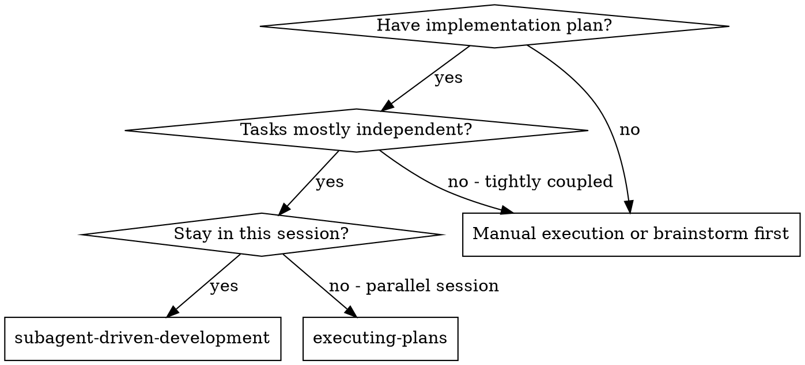
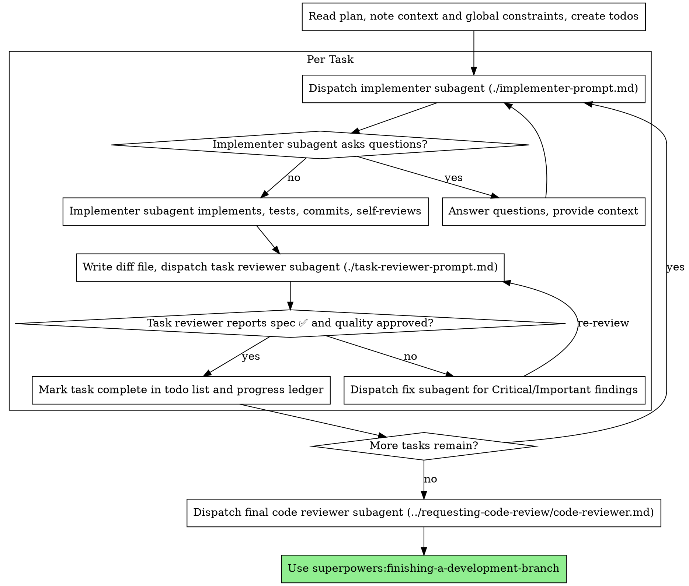

# 子代理驱动开发（Subagent-Driven Development）

通过为每个任务分派全新的实现者子代理、每个任务完成后进行任务评审（规范符合性 + 代码质量），以及最后进行宽泛的全分支评审，来执行计划。

**为什么要用子代理：** 你将任务委派给具备独立上下文的专用代理。通过精确构建它们的指令和上下文，可以确保它们保持专注并成功完成任务。它们绝不应继承你会话的上下文或历史——你准确地构造它们所需的信息。这也为你自己的协调工作保留了上下文。

**核心原则：** 每个任务使用全新的子代理 + 任务评审（规范 + 质量）+ 最终宽泛评审 = 高质量、快速迭代

**叙述：** 在工具调用之间，最多只写一行简短的说明——台账和工具结果会承载记录。

**持续执行：** 不要在任务之间停下来向人类伙伴确认。不间断地执行计划中的所有任务。唯一需要停下的原因是：无法解决的 BLOCKED 状态、真正阻碍进展的模糊性，或所有任务已完成。“我应该继续吗？”这类提示和进度总结会浪费他们的时间——他们要求你执行计划，所以去执行它。

## 何时使用



**与 Executing Plans（并行会话）对比：**
- 同一会话（无需切换上下文）
- 每个任务使用全新的子代理（无上下文污染）
- 每个任务后评审（规范符合性 + 代码质量），最后进行宽泛评审
- 迭代更快（任务之间无需人类介入）

## 流程



## 行前计划审阅

在分派任务 1 之前，先扫描一遍计划，检查冲突：

- 相互矛盾的任务，或与计划“全局约束”相矛盾的内容
- 计划中明确要求、但评审标准视为缺陷的任何内容（例如没有断言的测试、逐字重复的逻辑块）

将发现的所有问题一次性向人类伙伴提出——每条发现都附上作出要求的计划原文，并询问以哪个为准——在执行开始之前提出，而不是在执行过程中每发现一个就打断一次。如果扫描没有问题，无需说明，直接继续。评审循环仍然是只在实现后才显现的冲突的兜底网。

## 模型选择

为每个角色使用能胜任的最低能力模型，以节约成本并加快速度。

**机械实现任务**（独立函数、明确规范、1-2 个文件）：使用快速、便宜的模型。当计划明确时，大多数实现任务都是机械性的。

**集成与判断任务**（多文件协调、模式匹配、调试）：使用标准模型。

**架构与设计任务**：使用可用的最强模型。最终的全分支评审属于此类——要在最强可用模型上分派，而不是会话默认模型。

**评审任务**：选择与判断需求相当的模型，并根据 diff 的规模、复杂度和风险进行调整。小的机械性 diff 不需要最强模型；微妙的并发改动则需要。

**分派子代理时务必显式指定模型。** 省略模型会让它继承你会话的模型——通常是最强也最贵的——这会默默地违背本节原则。

**回合数胜过 token 价格。** 挂钟时间和上下文成本随子代理花费的回合数增长，而最便宜的模型在多步工作上通常需要 2-3 倍回合——总体成本反而更高。将中档模型作为评审员和根据 prose 描述工作的实现者的下限。当任务的计划文本包含要写的完整代码时，实现就是转录加测试：对该实现者使用最便宜的档位。单文件机械修复也使用最便宜档位。

**任务复杂度信号（实现任务）：**
- 涉及 1-2 个文件且规范完整 → 便宜模型
- 涉及多个文件且有集成顾虑 → 标准模型
- 需要设计判断或对代码库有广泛理解 → 最强模型

## 处理实现者状态

实现者子代理会返回四种状态之一。分别按如下方式处理：

**DONE：** 生成评审包（`scripts/review-package BASE HEAD`，从本 skill 目录运行——它会输出写入的唯一文件路径；BASE 是你分派实现者之前记录的提交，绝不是 `HEAD~1`，否则会在多提交任务中静默丢失除最后一次提交外的所有提交），然后将该路径分派给任务评审员。

**DONE_WITH_CONCERNS：** 实现者完成了工作，但提出了疑虑。在继续之前阅读这些疑虑。如果疑虑涉及正确性或范围，在评审前处理它们。如果只是观察（例如“这个文件越来越大了”），记录下来并继续评审。

**NEEDS_CONTEXT：** 实现者需要未提供的信息。提供缺失的上下文并重新分派。

**BLOCKED：** 实现者无法完成任务。评估阻塞原因：
1. 如果是上下文问题，提供更多上下文并用相同模型重新分派
2. 如果任务需要更多推理能力，用更强的模型重新分派
3. 如果任务太大，拆分成更小的部分
4. 如果计划本身错误，升级给人类

**永远不要**忽略升级，或在没有改变的情况下强制同一模型重试。如果实现者说它卡住了，就一定需要改变。

## 处理评审员的 ⚠️ 项

任务评审员可能会报告“⚠️ 无法从 diff 中验证”的项——这些需求存在于未改动的代码中或跨任务。它们不会阻塞评审的其余部分，但你必须在将任务标记为完成之前自己解决每一项：你掌握着计划，具备评审员缺乏的跨任务上下文。如果你确认某项是真正的缺口，将其视为规范评审失败——退回给实现者并重新评审。

## 构建评审员提示

每个任务的评审是任务范围的关口。宽泛评审只发生一次，即最终的全分支评审。填写评审模板时：

- 不要添加开放式指令，如“检查所有用法”或“如有用则运行 race 测试”，除非有具体、任务相关的理由
- 不要要求评审员重新运行实现者已在相同代码上运行过的测试——实现者的报告携带了测试证据
- 不要替评审员预先判断发现项——永远不要在提示中指示评审员忽略或不标记某个具体问题。如果你认为某项发现可能是误报，让评审员提出它，然后在评审循环中裁决。如果你写的提示中包含“不要标记”、“不要把 X 视为缺陷”、“最多 Minor”或“计划选择了”——停下：你正在预先判断，通常是为了省去一次评审循环。
- 你交给评审员的全局约束块是它的关注透镜。从计划的 Global Constraints 部分或规范中逐字复制约束性要求：精确值、精确格式，以及组件之间声明的关系（“与 X 布局相同”、“匹配 Y”）。评审员的模板已经携带了流程规则（YAGNI、测试卫生、评审方法）——约束块用于本项目规范所要求的内容。
- 将 diff 作为文件交给评审员：运行本 skill 的 `scripts/review-package BASE HEAD`，并将它输出的文件路径传给评审员（如果没有 bash：将 `git log --oneline`、`git diff --stat` 和 `git diff -U10` 的重定向输出到同一个唯一命名的文件中）。输出不会进入你自己的上下文，评审员会一次性看到提交列表、统计摘要和带上下文的完整 diff。使用你分派实现者之前记录的 BASE——绝不是 `HEAD~1`，否则会静默截断多提交任务。
- 分派提示描述的是一个任务，而不是会话历史。不要粘贴累积的先前任务摘要（“任务 1-3 之后的状态”）到后续分派中——真实会话中一次分派曾达到 42k 字符，其中 99% 是粘贴的历史。新的子代理只需要它的任务、它接触的接口和全局约束。仅此而已。
- 为 Critical 和 Important 发现分派修复子代理。Minor 发现随进展记录到账本中，并在最终全分支评审时指向该列表，以便它分流哪些必须在合并前修复。没人看的汇总等于默默丢弃。
- 标记为 plan-mandated 的发现——或任何与计划文本要求冲突的发现——与任何计划矛盾一样，由人类决定：呈现发现和计划原文，询问以哪个为准。不要因为计划要求就驳回发现，也不要在未询问的情况下分派与计划矛盾的修复。
- 最终全分支评审也需要一个包：运行 `scripts/review-package MERGE_BASE HEAD`（MERGE_BASE = 分支起始的提交，例如 `git merge-base main HEAD`），并将输出路径包含在最终评审分派中，这样最终评审员只需读取一个文件，而不必用 git 命令重新推导分支 diff。
- 每次修复分派都附带实现者契约：修复子代理重新运行覆盖其改动的测试并报告结果。在分派中命名覆盖的测试文件——一行修复不需要整套测试。在重新分派评审员之前，确认修复报告包含覆盖测试、运行的命令和输出；三者齐全后再分派重新评审。
- 如果最终全分支评审返回发现项，只分派 ONE 个修复子代理并附上完整发现列表——而不是每个发现各分派一个修复者。每个发现各分派修复者都会重建上下文并重新运行套件；真实会话中最终评审的修复波次成本超过了所有任务的总和。

## 文件交接

你粘贴到分派提示中的任何内容——以及子代理打印返回的任何内容——都会在你的上下文中驻留整个会话，并在之后的每一轮中被重新读取。将产物作为文件交接：

- **任务简报：** 分派实现者之前，运行本 skill 的 `scripts/task-brief PLAN_FILE N`——它会将任务的完整文本提取到一个唯一命名的文件中并输出路径。构造分派时让简报成为需求的单一来源。你的分派应包含：(1) 一句话说明该任务在项目中的位置；(2) 简报路径，介绍为“先读这个——它是你的需求，包含要逐字使用的精确值”；(3) 简报无法知道的来自前面任务的接口和决策；(4) 你对简报中任何模糊之处的解决方案；(5) 报告文件路径和报告契约。精确值（数字、魔法字符串、签名、测试用例）只出现在简报中。
- **报告文件：** 按简报命名实现者的报告文件（简报 `…/task-N-brief.md` → 报告 `…/task-N-report.md`）并在分派提示中指定。实现者将完整报告写入该文件，并只返回状态、提交、一行测试摘要和疑虑。
- **评审员输入：** 任务评审员获得三个路径——同一份简报文件、报告文件和评审包——加上约束该任务的全局约束。
- 修复分派将修复报告（含测试结果）追加到同一份报告文件，并返回简短摘要；重新评审时读取更新后的文件。

## 持久化进度

对话记忆在压缩后无法保留。在真实会话中，失去位置的控制器曾重新分派整个已完成的任务序列——这是观察到的最昂贵的单一失败。不仅在 todos 中，还要在台账文件中跟踪进度。

- 在 skill 启动时，检查是否存在台账：
  `cat "$(git rev-parse --show-toplevel)/.superpowers/sdd/progress.md"`。其中标记为完成的任务是 DONE——不要重新分派；从第一个未标记完成的任务继续。
- 当任务的评审干净返回时，在你的其他簿记工作同一条消息中追加一行到台账：
  `Task N: complete (commits <base7>..<head7>, review clean)`。
- 台账是你的恢复地图：即使你的上下文不再记得创建过它们，其中命名的提交仍存在于 git 中。压缩后，信任台账和 `git log` 胜过你自己的记忆。
- `git clean -fdx` 会破坏台账（它是 git 忽略的临时文件）；如果发生这种情况，从 `git log` 恢复。

## 提示模板

- [implementer-prompt.md](implementer-prompt.md) - 分派实现者子代理
- [task-reviewer-prompt.md](task-reviewer-prompt.md) - 分派任务评审员子代理（规范符合性 + 代码质量）
- 最终全分支评审：使用 superpowers:requesting-code-review 的 [code-reviewer.md](../requesting-code-review/code-reviewer.md)

## 示例工作流

```
你：我正在使用 Subagent-Driven Development 来执行这个计划。

[阅读计划文件一次：docs/superpowers/plans/feature-plan.md]
[为所有任务创建 todos]

任务 1：安装钩子脚本

[为任务 1 运行 task-brief；分派实现者，附带简报 + 报告路径 + 上下文]

实现者：“开始前——钩子应该安装在用户级别还是系统级别？”

你：“用户级别（~/.config/superpowers/hooks/）”

实现者：“明白了。现在开始实现……”
[稍后] 实现者：
  - 实现了 install-hook 命令
  - 添加了测试，5/5 通过
  - 自查：发现漏了 --force 标志，已添加
  - 已提交

[运行 review-package，将输出的路径分派给任务评审员]
任务评审员：规范 ✅ - 所有需求已满足，没有额外内容。
  优点：测试覆盖良好，代码清晰。问题：无。任务质量：通过。

[标记任务 1 完成]

任务 2：恢复模式

[为任务 2 运行 task-brief；分派实现者，附带简报 + 报告路径 + 上下文]

实现者：[没有问题，继续]
实现者：
  - 添加了 verify/repair 模式
  - 8/8 测试通过
  - 自查：一切正常
  - 已提交

[运行 review-package，将输出的路径分派给任务评审员]
任务评审员：规范 ❌：
  - 缺失：进度报告（规范要求“每 100 项报告一次”）
  - 多余：添加了 --json 标志（未要求）
  问题（Important）：魔法数字（100）

[分派修复子代理处理所有发现项]
修复者：移除了 --json 标志，添加了进度报告，提取了 PROGRESS_INTERVAL 常量

[任务评审员再次评审]
任务评审员：规范 ✅。任务质量：通过。

[标记任务 2 完成]

...

[所有任务完成后]
[分派最终 code-reviewer]
最终评审员：所有需求已满足，可以合并

完成！
```

## 优势

**与手动执行相比：**
- 子代理自然遵循 TDD
- 每个任务有全新上下文（不会混淆）
- 并行安全（子代理互不干扰）
- 子代理可以提问（工作前和工作中都可以）

**与 Executing Plans 相比：**
- 同一会话（无需交接）
- 持续推进（无需等待）
- 评审检查点自动进行

**效率提升：**
- 控制者精确整理所需上下文；大体积产物以文件形式流转，而不是粘贴文本
- 子代理 upfront 获得完整信息
- 问题在工作开始前暴露（而不是之后）

**质量关口：**
- 自查在交接前发现问题
- 任务评审包含两个裁决：规范符合性和代码质量
- 评审循环确保修复真正有效
- 规范符合性防止过度/不足构建
- 代码质量确保实现构建良好

**成本：**
- 更多子代理调用（每个任务都有实现者 + 评审员）
- 控制者需要做更多准备工作（提前提取所有任务）
- 评审循环增加迭代次数
- 但能尽早发现问题（比事后调试更便宜）

## 危险信号

**永远不要：**
- 未经用户明确同意就在 main/master 分支上开始实现
- 跳过任务评审，或接受缺少任一裁决的报告（规范符合性和任务质量两者都需要）
- 带着未修复的问题继续
- 并行分派多个实现子代理（会冲突）
- 让子代理读取整个计划文件（改为 handing it its task brief —— `scripts/task-brief`）
- 跳过场景设定上下文（子代理需要理解任务位置）
- 忽略子代理的问题（让它继续前先回答）
- 在规范符合性上接受“差不多”（评审员发现规范问题 = 没完成）
- 跳过评审循环（评审员发现问题 = 实现者修复 = 再次评审）
- 让实现者自查取代实际评审（两者都需要）
- 告诉评审员不要标记什么，或在分派提示中预先评定发现项的严重程度（“最多当作 Minor”）——计划中的示例代码只是起点，不是其弱点被选择的证据
- 在没有 diff 文件的情况下分派任务评审员——先生成它（`scripts/review-package BASE HEAD`），并在提示中命名输出的路径
- 评审还有未解决的 Critical/Important 问题时进入下一个任务
- 重新分派进度台账已标记完成的任务——在压缩或恢复后检查台账（以及 `git log`）

**如果子代理提问：**
- 清晰、完整地回答
- 在需要时提供额外上下文
- 不要催促它们进入实现

**如果评审员发现问题：**
- 由实现者（同一子代理）修复
- 评审员再次评审
- 重复直到通过
- 不要跳过重新评审

**如果子代理任务失败：**
- 分派修复子代理并给出具体指令
- 不要手动修复（会污染上下文）

## 集成

**必需的工作流 skill：**
- **superpowers:using-git-worktrees** - 确保隔离的工作空间（创建或验证已存在）
- **superpowers:writing-plans** - 创建本 skill 执行的计划
- **superpowers:requesting-code-review** - 最终全分支评审的代码评审模板
- **superpowers:finishing-a-development-branch** - 完成所有任务后的开发收尾

**子代理应使用：**
- **superpowers:test-driven-development** - 子代理为每个任务遵循 TDD

**替代工作流：**
- **superpowers:executing-plans** - 用于并行会话而非同一会话执行
